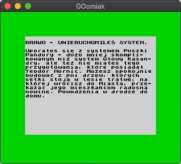

<p align="center">
  
  <h2 align="center">GOomiak</h2>
  <p align="center">A very simple ZX Spectrum 48K emulator</p>
</p>

---

GOomiak (pron. ɡũmʲjak) is a ZX Spectrum 48K emulator written in GO.


## Features

* Pretty good Zilog Z80 chip emulation
  * Passes [zexall](http://mdfs.net/Software/Z80/Exerciser/Spectrum/) & [zexdoc](http://mdfs.net/Software/Z80/Exerciser/Spectrum/) excercisers
  * Full memptr (also known as WZ shadow register) emulation
  * All undocumented opcodes support (`DD CB`, `FD CB`, `SLL` etc.)
* Basic level ULA emulation
  * Screen drawing is more-or-less similar to how ULA draws screen and blocks CPU in a process
  * No contended memory support
  * No contended I/O support
  * No sound support
* TAP (including autoloading) and Z80 files support

## Is it any good?

**Absolutely not.** I wanted to learn GO, and needed some excercise. Also, always wanted to write an emulator.
However, I wasn't aware how big of a mess Z80 is. If I knew, I would probably settle with something simpler (NES probably).
But hey - had ton of fun writing it, learned a lot and the app is usable. My main goal was to make it run
[this game](https://worldofspectrum.org/archive/software/text-adventures/puszka-pandory-marcin-borkowski) and it does it.

If you're looking for a proper Speccy emulator, but somehow ended up here, I highly recommend
[Fuse](http://fuse-emulator.sourceforge.net/) or [ZEsarUX](https://github.com/chernandezba/zesarux).
Both provide amazing quality of emulation (especially the latter one).

## Legal

* Spectrum ROM images are freely available. [Amstrad have kindly given their permission for the redistribution of their copyrighted material but retain that copyright](doc/roms-legal.txt). Kudos to them.
* [DiagROM Homepage](http://blog.retroleum.co.uk/electronics-articles/a-diagnostic-rom-image-for-the-zx-spectrum/)

## How to run it?

You need [GO](https://golang.org/doc/install) installed. Then it's as simple as:

```
~/goomiak/src$ go run main.go
```

## Testing

Most of the emulator has proper test coverage (especially CPU). To run tests:

```
~/goomiak/src$ go test ./...
```

You can also run some pre-made tap files with tests, to see them in action:

```
~/goomiak$ make zexall
~/goomiak$ make zexbit
~/goomiak$ make zexdoc
~/goomiak$ make z80tests
```

There are also many tests which I found in the [tests/other](tests/other) directory. If you plan to write your own Z80 emulator, they may provide some help.

## License

[MIT](LICENSE)
